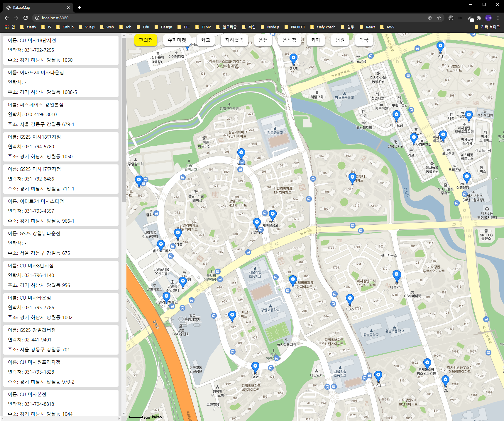
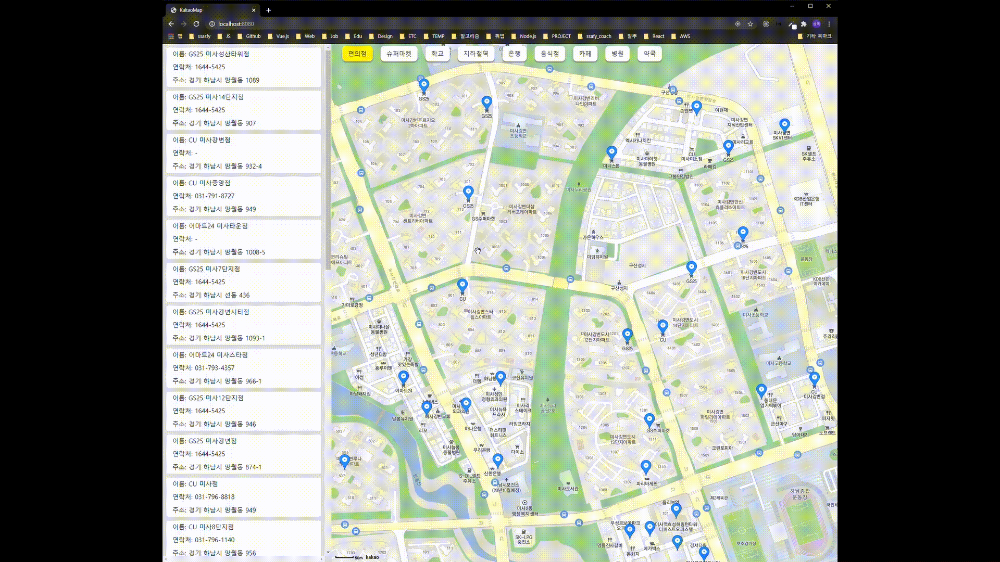
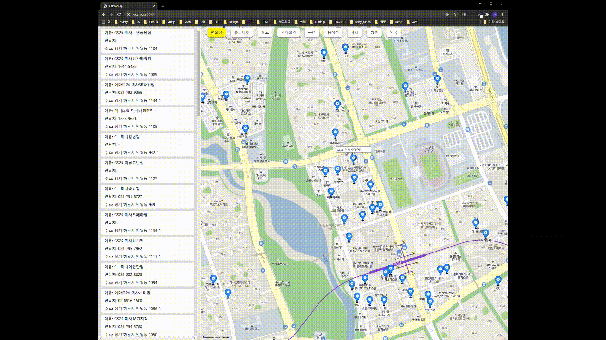
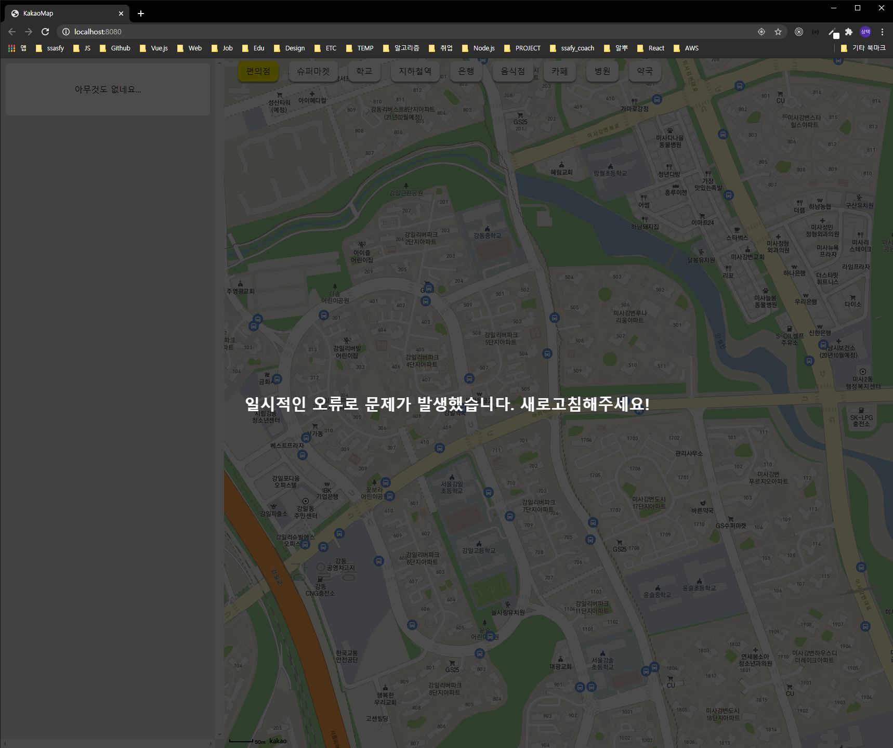

# Kakao Map을 이용한 주변 시설물 조회

Kakao Map API를 이용하여 현재 위치의 주변 시설물을 조회하는 프로젝트

<br/>

# Install

`npm install && npm run start`

<br/>

# Project

`vanillaJS`, `live-server`, `kakao-map api`

<br/>

# Proxy

데이터가 변하면 이에 반응하여 행동을 취할 수 있도록 의 proxy를 사용했습니다. 

```js
// App.js

this.state = new Proxy({
    placeList: [],
    err: false,
    loc,
    mapLevel: 3,
    clickedPlace: null,
    category: { ko: "편의점", en: "convenience", code: "CS2" },
}, {
    get: (target, prop) => Reflect.get(target, prop),
    set: (target, prop, value) => {
        // observe placeList
        if (prop === 'placeList') {
            this.sidebar.updateSidebar(value);
            // observe err
        } else if (prop === 'err') {
            if (value) {
                this.error.showError();
            } else {
                this.error.hideError();
            }
            // observer for marker
        } else if (prop === 'clickedPlace') {
            const {place, target} = value
            if (target === 'map') {
                this.map.showMarker(place);
            } else if (target === 'sidebar') {
                this.sidebar.setPlaceClicked(place);
            }
        } else if (prop === 'category') {
            this.map.changeCategory(value.code);
        }
        return Reflect.set(target, prop, value);
    }
})
```

[Proxy | MDN]: https://developer.mozilla.org/ko/docs/Web/JavaScript/Reference/Global_Objects/Proxy

<br/>

# Summary



## Selector, Sidebar, Map

카테고리는 편의점, 슈퍼마켓, 학교, 지하철역, 은행, 음식점, 카페, 병원, 약국으로 총 9개가 있고 현재 위치 주변에 있는 현재 카테고리에 해당하는 시설물을 `kakao api`를 통해 받아와 지도에 뿌려줍니다. 또한 해당 시설물들이 사이드바에 보여집니다. 현재 위치 주변에 해당 시설물이 없을 경우 아무것도 없음을 의미하는 UI를 보여줍니다.

<br/>


## Drag

kakao map의 `drag 리스너`를 이용하여 사용자가 마우스를 이용하여 드래그를 하면 이에 맞게 맵이 이동하고 해당 위치의 시설물들을 Map과 Sidebar를 통해 보여줍니다.

<br/>


## Zoom

`마우스 휠`을 이용한 줌 기능을 제공합니다.

<br/>


## Sidebar, Infowindow

Sidebar에 있는 시설 카드를 클릭하면 맵이 해당 위치로 이동하고, 시설물의 이름이 Infowindow를 통해 보여집니다. 그리고 해당 Infowindow를 클릭하면 해당 시설물의 카카오 페이지로 이동합니다.

<br/>



## Sidebar, Infowindow

InfoWindow를 클릭하면 사이드바에 있는 해당 시설물이 표시됩니다.

<br/>



## Error

일시적인 오류로 에러가 발생했을 때, 이를 알려주는 에러 UI입니다.